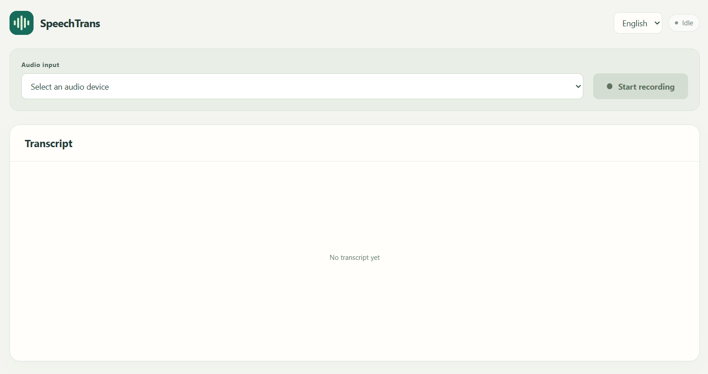

# SpeechTrans

SpeechTrans is a local speech transcription and translation tool with a React web interface and a Python backend. It transcribes English audio with Whisper or Parakeet and translates the text into Simplified Chinese with NLLB.

Use it to follow English conversations, lectures, or audio played through an available recording device. Select a microphone or an operating-system-provided loopback input, such as Stereo Mix. System audio capture requires such an input to be available; selecting a normal microphone does not directly capture computer playback.


## Preview



## Installation

The commands below use **Windows PowerShell**. Download or clone the repository, then open a terminal in its root directory. Installation commands download dependencies; run them before starting the application.

### 1. Prerequisites

- Python **3.11 or later**, with a version supported by the selected PyTorch and NumPy packages.
- [Node.js](https://nodejs.org/) **22.12 or later**.
- [FFmpeg](https://ffmpeg.org/download.html).

### 2. Backend dependencies

From the repository root, create a virtual environment and install the dependencies in `requirements.txt`:

```powershell
python -m venv .venv
.\.venv\Scripts\python.exe -m pip install --upgrade pip
.\.venv\Scripts\python.exe -m pip install -r requirements.txt 
```

### 3. FFmpeg

On Windows, download a build containing `ffmpeg.exe`, put it in `backend/ffmpeg/ffmpeg.exe`.


### 4. Frontend dependencies

From the repository root:

```powershell
cd frontend
npm ci
```

This installs the frontend dependencies from `package-lock.json`. Node.js.

## Start the application

Keep two terminals open. Start each set of commands from the repository root.

### Terminal 1: backend

```powershell
cd backend
..\.venv\Scripts\python.exe main.py
```

Wait for the model loading to finish and Uvicorn to report that the server is running:

```text
http://127.0.0.1:8080
```

### Terminal 2: frontend

```powershell
cd frontend
npm run dev
```

Open:

```text
http://localhost:5173
```


